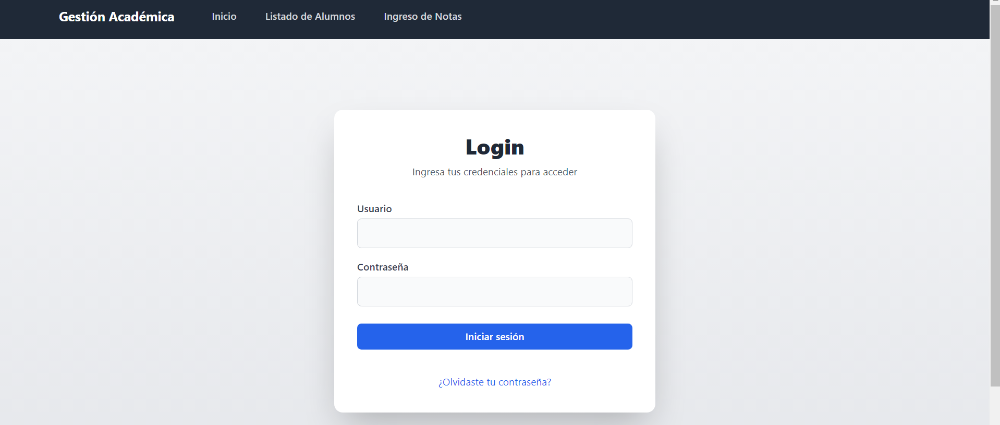
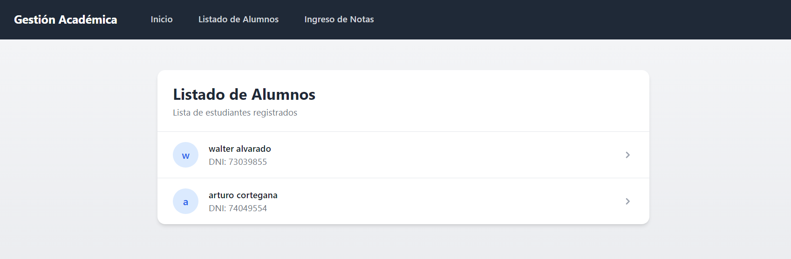
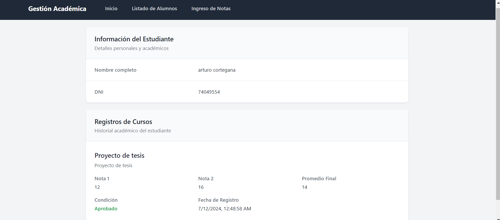
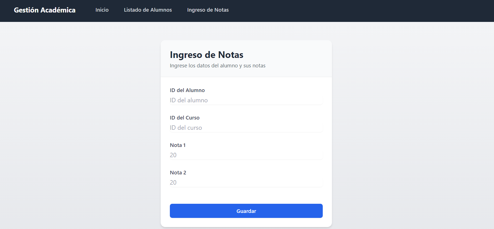
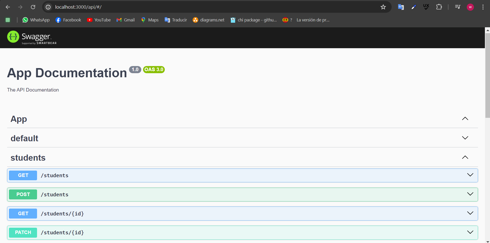

# tdb-exam

para hacer una migración de la base de datos

```
cd tdb-backend
npx prisma migrate dev --name init
```

para iniciar el backend
```
cd tdb-backend
npm run start:dev
```

para iniciar el Frontend
```
cd tdb-frontend
npm run dev
```
http://localhost:5173/

### Login
usuario: walter

contraseña: walter


### Listado de Alumnos

### Detalle alumno

### Ingreso de notas


### Documentación del API 
http://localhost:3000/api/

